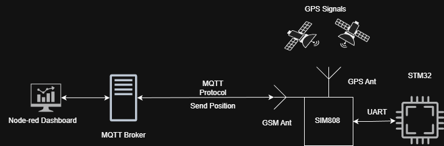
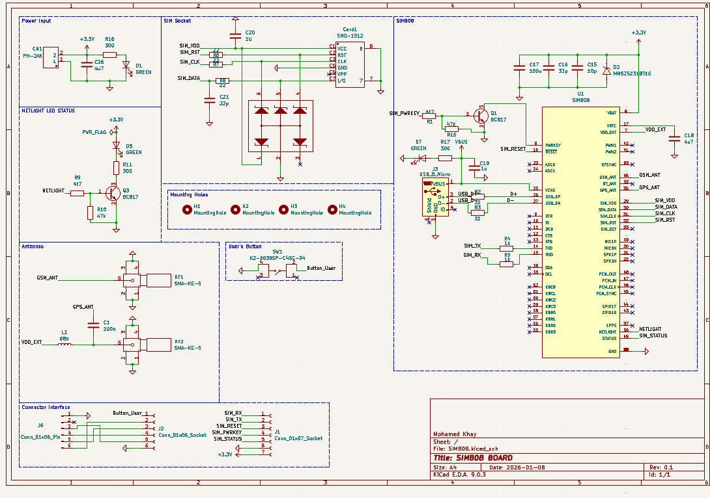
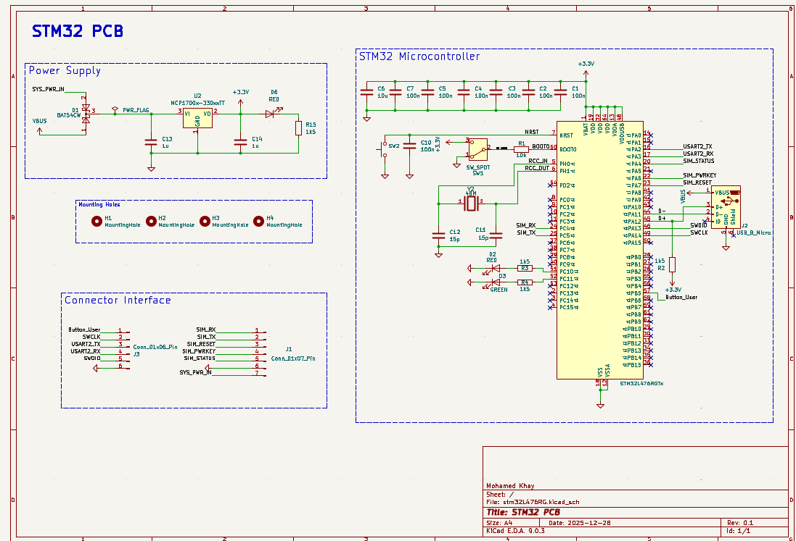
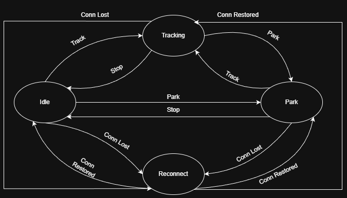
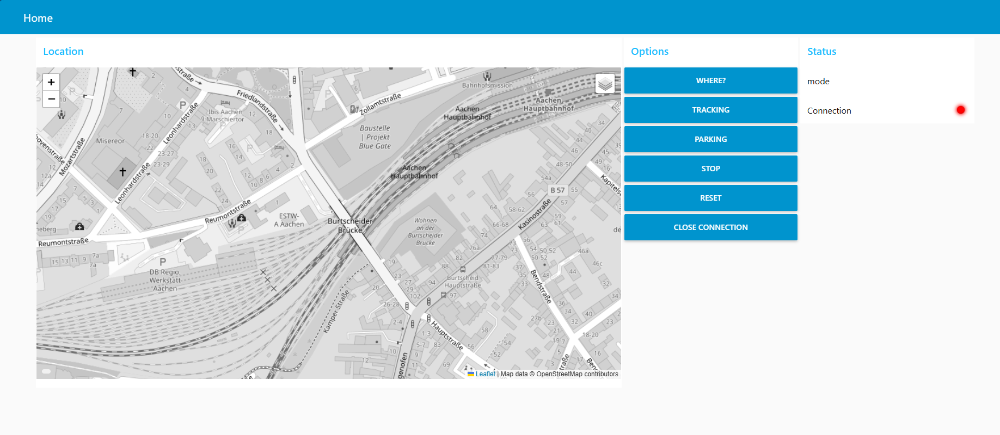

# GPS Tracker Using STM32 and SIM808

Embedded IoT tracker based on STM32 and SIM808, providing
GPS positioning, SMS control, and MQTT communication with
a Node-RED backend.

## Features
- GPS position acquisition (SIM808)
- SMS send / receive
- MQTT communication over GPRS
- Node-RED dashboard integration
- Custom PCB design

## Repository Structure
stm32-sim808-gps-mqtt/
├── firmware/     STM32CubeIDE project

├── PCB Design/   PCB schematics and layout

├── Node-Red/     Node-RED flows and dashboard

├── Docs/         Documentation

├── Images/       Pictures

## System Overview

The STM32 communicates with the SIM808 module via UART.
GPS data is parsed on the MCU and sent either via SMS or
published to an MQTT broker over GPRS. Node-RED processes
incoming data and provides visualization and control.

## PCB Design

The PCB design is divided into two separate boards:

1.One board for the STM32 MCU

2.One board for the SIM808 module

These boards are stacked on top of each other using a common connector interface.

# SIM808 

Notes:

The board uses a LiPo battery as the main power source. The SIM808 module includes an internal charging circuit accessible via USB.

According to the datasheet, when powering the system with a LiPo battery, no additional voltage regulator is needed, provided the battery delivers 3.7 V nominal and 2 A peak.

Both the GPS and GSM antennas require 50 Ω impedance traces and should be placed as close as possible to the module for optimal signal performance.

# STM32 

Notes:

The board uses an MCP1700 voltage regulator to provide stable 3.3 V to the STM32.

There are two power inputs:

1.USB

2.Power from the SIM808 board via a dedicated connector

A Schottky diode is used to prevent backflow and protect the STM32 when multiple power sources are connected.

## Firmware Design

The firmware is structured around a finite state machine (FSM) to securely manage the different operational modes of the module:

- Idle: The module waits for incoming commands or triggers.

- Tracking: Begins continuous position tracking using a timer.

- Parking: Sends the current position and waits for either a “theft move” or “stop” command.

- Reconnect: At any state, if the module detects a disconnection, it transitions to the Reconnect state to re-establish the connection, then returns to the previous state.

Alongside the FSM, a watchdog timer monitors the connection every 30 seconds and attempts to reconnect if needed, ensuring reliable communication.

# Firmware Modules

* SIM808.c
Responsible for all SIM808 communications, including:

- Sending AT commands

- Parsing GPS data

- Handling message transmission and waiting for responses

* MQTT (mqtt.c / mqtt.h)
Implements the MQTT protocol using the Paho MQTT library, helping to build and send MQTT packets.

* tracker_fsm.c
Implements the state machine, including:

- Event handlers
- State transitions

## Node-RED Dashboard

The dashboard is built using Node-RED and a world map visualization.

Node-RED natively supports MQTT, so once the STM32 firmware publishes a position, the Node-RED flow (as a subscriber) receives it and displays it as a pointer on the map.

Since the system has multiple operational modes (continuous tracking, parking, etc.), a global variable tracks the current mode. This allows the dashboard to adjust the visualization accordingly:

Continuous tracking → plots the path as a line

Parking mode → shows a circle around the parked area

Commands are sent from the dashboard using buttons that publish messages to the MQTT broker. The SIM808 module on the device subscribes to these commands and acts accordingly.

## Further Notes

The project is still under development.

The source code is being updated and may change as new features are added or improvements are made.
